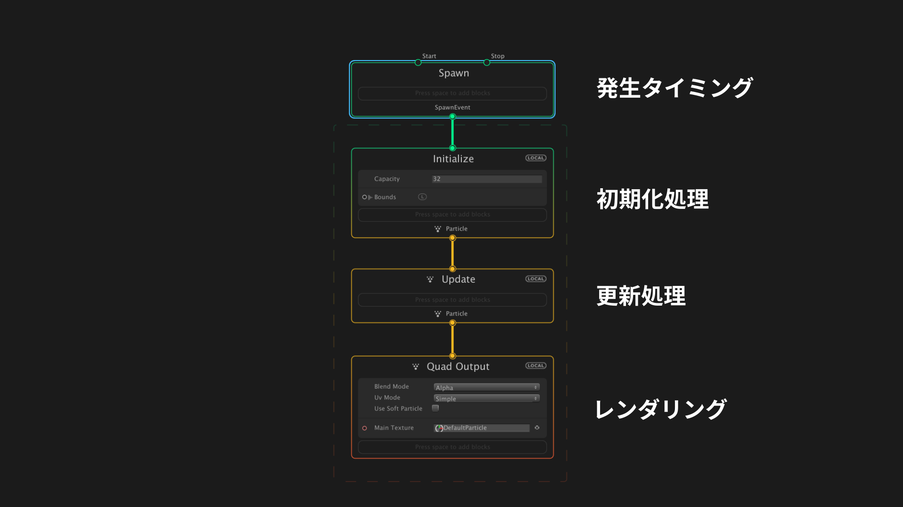

---

Demonstration

---

- VFX Graph とは
- RealSense との 繋ぎ込み

---

VFX Graph とは

---

GPU パーティクルです

---

---

---

&nbsp;

---

RealSense との 繋ぎ込み

---

---

---

---

---

---

 

---

&nbsp;

---

Volumetric Filmmaking

---
