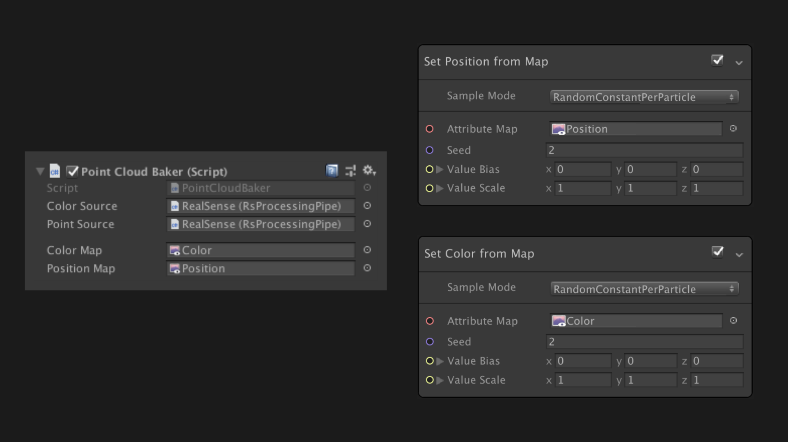

VFX Graph + RealSense = Fun

---

https://github.com/Unity-Technologies/VisualEffectGraph-Samples

---

- VFX Graph とは
- RealSense との 繋ぎ込み

---

VFX Graph とは

---

Visual Effect Graph

---

GPU パーティクルです

---

---

---

&nbsp;

---

RealSense との 繋ぎ込み

---

---

---

---

---

---

 

---

https://github.com/keijiro/Rsvfx

---

&nbsp;

---

Volumetric Filmmaking

---

[Depthkit](https://www.depthkit.tv/)

---

&nbsp;

---

まとめ

---

- VFX Graph = パーティクル
- Attribute Map で繋ぎ込み
- Volumetric Video 面白い

---

&nbsp;

---
